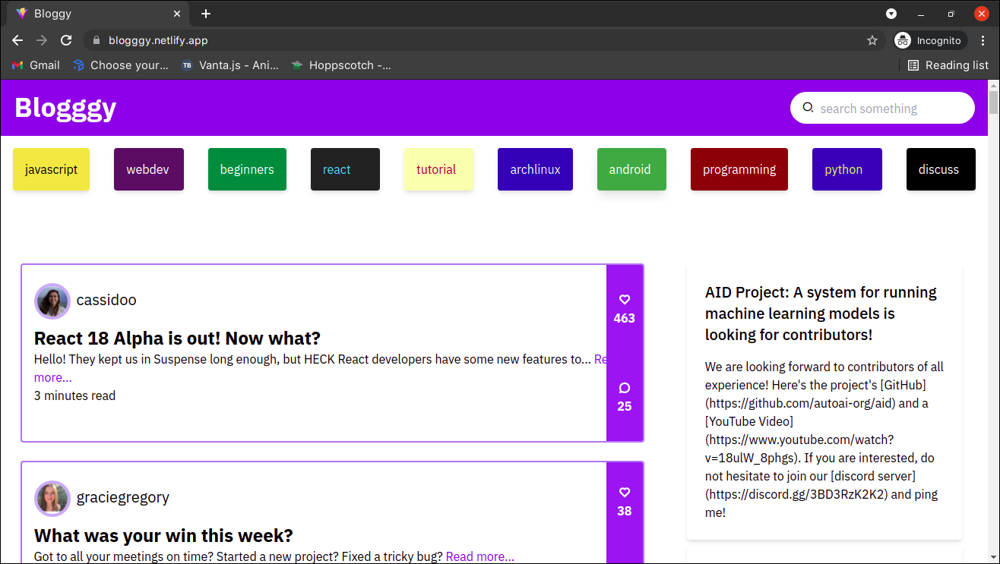

# Blogggy


## Demo


  [go to site](https://blogggy.netlify.app/)
## Run Locally

Clone the project

```bash
  git clone https://github.com/devpenzil/Bloggy.git
```

Go to the project directory

```bash
  cd Blogggy
```

Install dependencies

```bash
  npm install
```

Start the server

```bash
  npm run dev
```

  
## Authors

- [@AjoAlex](https://www.github.com/devpenzil)

  
## API Reference


```http
  GET https://dev.to/api/articles/
```
